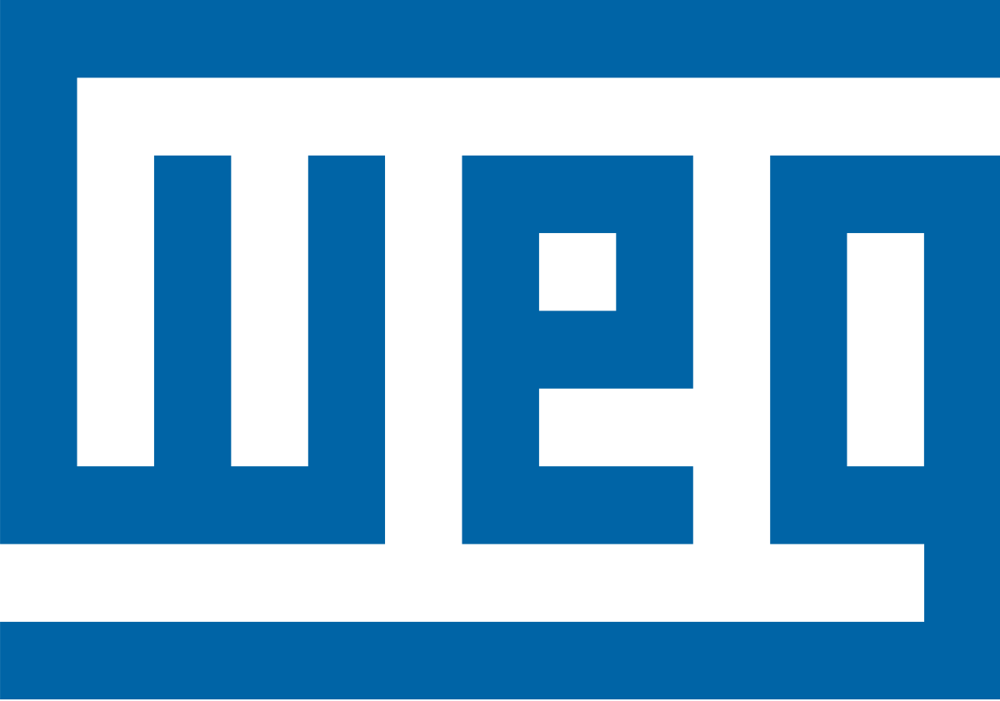

A empresa **WEG** é uma multinacional que é conhecida por suas atitudes sustentáveis, premiada inúmeras vezes por sua inovação. Uma empresa que segue uma visão onde busca “ser referência global em motores, geradores, transformadores e acionamentos elétricos com uma ampla oferta integrada para eletrificação, automação e digitalização.”

Visando uma melhoria de um novo sistema para registrar demandas de novos sistemas e buscando extinguir o uso do formulário em SharePoint, a WEG sugere projetar e desenvolver um sistema para gerenciamento dos processos das demandas durante sua execução. Tendo isso em vista, a empresa nota a necessidade de facilitar o método burocrático de gestão das solicitações e aprovações de sistemas de TI, centralizando os dados e otimizando o processo produtivo. Resultando em um aprimoramento tecnológico com processos que carreguem seu propósito:  “Desenvolver tecnologias e soluções para contribuir na construção de um mundo mais eficiente e sustentável”.

O sistema contará com interfaces simples e de fácil adaptação, visando uma melhor e mais rápida habituação com a nova ferramenta. 

A aparência do sistema contará com as cores presentes na logo, que representam e levam a identidade da empresa.

As cores representam cada estágio dos processos presentes no sistema:

`Demandas`   `Propostas`

`Pautas`     `Atas`
