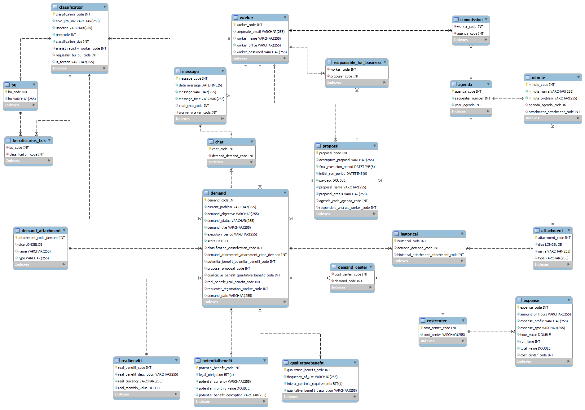

# Manual Técnico - GEDESTI
## Gerenciamento de Demandas de Sistemas de TI

### 1. INTRODUÇÃO

#### 1.1. TEMA
Sistema de solicitação e gerenciamento de demandas de TI para funcionários internos da empresa WEG S.A.

#### 1.2. OBJETIVO DO PROJETO

Implementar um sistema de solicitar e gerenciar demandas de TI, criação de demandas, geração de propostas para os fóruns/comissão de aprovação e criação das determinadas atas discutidas nos fóruns de aprovação. 

#### 1.3. DELIMITAÇÃO DO PROBLEMA

Processo de solicitação e gerenciamento de demandas defasado e carência de segurança durante todo o processo.

#### 1.4. JUSTIFICATIVA DA ESCOLHA DO TEMA 

Visando uma melhoria de um novo sistema para armazenar e organizar demandas de novos sistemas e buscando extinguir o uso do formulário em SharePoint, a empresa sugere projetar e desenvolver um sistema para gerenciamento dos processos das demandas durante seu aprimoramento de dados. Tendo isso em vista, a empresa WEG, nota a necessidade de facilitar o método burocrático de gestão das solicitações e aprovações de recomendações de sistemas de TI, centralizando os dados e otimizando o processo produtivo.  
Resultando em um aprimoramento tecnológico com processos que carreguem seu propósito:  “Desenvolver tecnologias e soluções para contribuir na construção de um mundo mais eficiente e sustentável”.

#### 1.5. MÉTODO DE TRABALHO

O padrão de projeto seguido é a metodologia ágil, onde visa fazer entregas contínuas à empresa, bem como a rotatividade entre os integrantes da equipe em meio acadêmico, fazendo com que todos adquiram conhecimento em todas as áreas no processo de desenvolvimento de um sistema. 
Ademais, a prática de realização de Sprints a cada 15 dias, para que o processo e a documentação seja atualizada constantemente. 

### 2. DESCRIÇÃO GERAL DO SISTEMA

#### 2.1. DESCRIÇÃO DO PROBLEMA 

Os processos realizados atualmente são feitos manualmente e desorganizados. A empresa busca extinguir o uso de formulários onde carregam informações duplicadas, gerando um consumo de tempo acima do necessário a aqueles que trabalham analisando esses dados para a geração da documentação necessária para a realização dos projetos solicitados. 
Além de causar falhas de segurança ao armazenar essas informações que podem comprometer a imagem empresarial em plataformas instáveis e sem a privacidade adequada. 

#### 2.2. PRINCIPAIS ENVOLVIDOS E SUAS CARACTERÍSTICAS 

##### 2.2.1. USUÁRIOS DO SISTEMA 

Destinado aos funcionários da empresa WEG S.A. que possuem acesso ao e-mail corporativo. Os mesmos devem conter noções básicas de como funciona o processo de solicitação e aprovação   de demandas.

##### 2.2.2. DESENVOLVEDORES DO SISTEMA

Composto por uma equipe de de alunos/desenvolvedores:
Eduarda Bolgenhagen de Campos;
Ester Girelli;
Vytor Augusto Rosa;
Leonardo Heitor Poglia.

Orientadores: 
Thatiana Duarte do Amarante (Professora de Análise e Documentação de Sistemas);
Romário Hornburg (Professor de Desenvolvimento/Programação);
Jair Paulo Satig (Gerente de Sistemas de Engenharia WEG).

Frisando que todos os integrantes atuaram em todas as áreas de desenvolvimento de um projeto, havendo sempre rotatividade entre eles.

#### 2.3. REGRA DE NEGÓCIO

A empresa WEG é uma multinacional que é conhecida por suas atitudes sustentáveis, premiada inúmeras vezes por sua inovação. Uma empresa que segue uma visão onde busca “ser referência global em motores, geradores, transformadores e acionamentos elétricos com uma ampla oferta integrada para eletrificação, automação e digitalização.”

A indústria evoluiu e a empresa WEG acompanhou o crescimento. As demandas de  processos de soluções digitais são utilizadas para a conexão dos parques fabris que visa causar o menor número de impactos ambientais com suas aplicações em diversas áreas. 
Tendo isso em vista, a WEG nota a necessidade de facilitar o processo burocrático de gestão das solicitações e aprovações de sistemas de TI . Considerando a partir disso uma maior agilidade na troca de pareceres durante o processo de desenvolvimento de demandas, propostas, pautas e atas. Além de melhorar o armazenamento de informações contidas nos projetos, tendo uma centralização dos dados em uma plataforma, buscando ganhar tempo ao realizar pesquisas de determinadas demandas.

Em síntese, auxiliar e otimizar a empresa WEG na produção dos sistemas para o seu desenvolvimento acompanhando a tecnologia, bem como apropriar esse processo a ser um processo que carregue o seu propósito: “Desenvolver tecnologias e soluções para contribuir na construção de um mundo mais eficiente e sustentável.”
O sistema tem como finalidade a solicitação da demanda, elaboração de proposta, geração e registro de atas. E poderá ser acessado por usuários WEG sendo eles solicitante, analista de TI, gerente de negócio e gerente de TI através de um login corporativo, cada qual com suas funções.

O solicitante é qualquer usuário de computador com login na rede corporativa WEG. Seu acesso tem como permissão criar uma nova demanda e consultar as demandas de seu departamento; O gerente de negócio é somente colaboradores com cargo de Gerente. Seu acesso poderá aprovar ou reprovar a solicitação e consultar as demandas da sua área; O Analista de TI tem total acesso para solicitar, aprovar, devolver, classificar demanda, criar proposta, criar pauta, criar atas, incluir parecer, informar ata e parecer DG e incluir anexos referente ao projeto; Por fim, o Gestor de TI poderá ter acesso total a todas as funcionalidades do sistema.

O sistema deverá responder diversas funcionalidades, dentre elas, uma tela de autenticação de usuário que irá redirecionar conforme a persona, ao seu respectivo menu com suas permissões. Todas as personas deverão ter a funcionalidade de criar novas demandas adicionando todas as informações necessárias assim como as visualizações das mesmas. Podendo também consultar as demandas através de um filtro onde pode-se selecionar diferentes campos.

O sistema deverá ter uma tela para definição do fórum/comissão e analista responsável pelas demandas do fórum. Além disso, as demandas passarão pelo Analista de TI e pelo Gerente responsável para classificar as mesmas através de suas características. Se aprovado, o processo irá proceder a criação da proposta conforme a demanda, informando o código da demanda no sistema PPM (módulo do SAP) e link para o EPIC do projeto no Jira. 

As demandas do sistemas serão baseadas em um workflow, que definirá um status conforme sua execução. Os status poderão ser alterados pelo analista responsável sempre que houver um avanço no seu desenvolvimento. Os status serão: Backlog (status que a demanda recebe quando é inserida, ou seja, aberta até a aprovação do gerente de TI), Assessment (construção da proposta, até a aprovação da comissão), Business case (é similar ao assesment, porém, requer muito mais estudo em cima da demanda para a construção da proposta), Cancelled (reprovada, em qualquer etapa do processo).

O sistema terá a funcionalidade de criar propostas para o comitê, incluindo os custos totais daquele projeto, além de informações que levarão à execução do projeto.
As atas são geradas através dos dados da proposta feita pelo analista, permitindo- o fazer ajustes e edições solicitadas pela comissão. O sistema também deverá ter um backup de todas as alterações feitas naquela proposta para permitir auditoria. Por fim, as propostas poderão ser reprovadas ou aprovadas, tendo a possibilidade de prosseguir ou paralisar os processos de desenvolvimento da demanda em qualquer circunstância.

### 3. REQUISITOS DO SISTEMA

#### 3.1. REQUISITOS FUNCIONAIS 

| ID | Nome |
| ----- | -----| 
| RF001 |Inserir E-mail |
| RF002 | Inserir senha |
| RF003 |Login |
| RF004 | Verificação de persona |
| RF005 | Redirecionamento para pagina da persona (Todos) |
| RF006 | Visualização das  demandas do seu setor (Solicitante) |
| RF007 | Visualização de todas as demandas (Gerente de Negócio, Analista de TI, Gestor de TI) |
| RF008 | Filtrar demandas (Todos) |
| RF009 | Download das demandas filtradas para EXCEL (Todos) |
| RF010 | Criação de demanda (Todos) |
| RF011|Inserir o título da demanda (Todos)|
| RF012|Descrever o objetivo da demanda (Todos)|
| RF013|Descrever a situação atual (Todos)|
| RF014|Inserir o centro de custos (Todos)|
| RF015|Escolher a moeda do benefício (Todos)|
| RF016|Inserir o benefício real (Todos)|
| RF017|Calcular o benefício potencial  (Todos)|
| RF018|Descrever benefícios qualitativos (Todos) |
| RF019|Descrever a frequência de uso do sistema (Todos)|
| RF020|Inserir anexo de detalhes de necessidade usuário (Opcional) (Todos)|
| RF021|Concluir o envio da demanda (Todos)|
| RF022|Aprovação ou Reprovação das demandas (Gerente de Negócios)|
| RF023|Inserir o motivo da Reprovação de uma demanda no modal (Gerente de Negócios)|
|RF024|Classificar demandas (WorkFlow) (Analista de TI)|
|RF025|Reelaborar demanda (Analista de TI)|
|RF026|Criar proposta para comissão/comitê (Analista de TI)|
|RF027|Incluir escopo da demanda na proposta (Analista de TI)|
|RF028|Incluir a tabela de custo da solicitação da demanda na proposta (Analista de TI)|
|RF029|Inserir tipo de despesa Externa e Interna (Analista de TI)|
|RF030|Inserir o perfil da despesa (Analista de TI)|
|RF031|Inserir  o período de execução em meses (Analista de TI)|
|RF032|Inserir  a quantidade de horas necessárias (Analista de TI)|
|RF033|Inserir  o valor da hora (Analista de TI)|
|RF034|Inserir  o valor total da despesa (Analista de TI)|
|RF035|Inserir  o centro de custo pagantes (Analista de TI)|
|RF036|Inserir PayBack simples na proposta (Analista de TI)|
|RF037|Inserir Período de execução da demanda na proposta(Analista de TI)|
|RF038|Inserir o responsável pelo negócio (Analista de TI) |
|RF039|Inserir os anexos (Analista de TI)|
|RF040|Informar o parecer da comissão (Analista de TI)|
|RF041|Criar pauta para a comissão / comitê (Analista de TI)|
|RF042|Determinar se o assunto será registrado em ata não publicada ou ata publicada  na pauta (Analista de TI)
|RF043|Criar a ata para a comissão / comitê (Analista de TI)|
|RF044|Adequar a ata porém mantendo o link (Analista de TI)|
|RF045|Gerar PDF das atas para cada pauta de reunião da comissão (Analista de TI)|
|RF046|Incluir parecer da comissão / comitê na ata (Analista de TI)|
|RF047|Informar o número ata DG (Analista de TI)|
|RF048|Anexar o documento da aprovação (Analista de TI)|
|RF049|Inserir um parecer para o DG sobre a comissão / comitê (Analista de TI)|
|RF050|Incluir anexos referente ao processo (Analista de TI)|
|RF051|Visualização de status de demandas (WorkFlow) (Analista de TI)|

##### 3.1.1. ESPECIFICAÇÃO DOS REQUISITOS FUNCIONAIS 

[Especificação dos Requisitos Funcionais](https://docs.google.com/spreadsheets/d/1XdAVVfQJE_mOSF6L4DU8GxcCyB7Ah_P0AT4s7RUcqcg/edit?usp=sharing)

#### 3.2. REQUISITOS NÃO FUNCIONAIS 

|ID|Nome|
| ----- | -----| 
|RNF001|Autenticação de fatores em duas etapas - Segurança|
|RNF002|Necessidade de integração de banco de dados  - Interoperabilidade|
|RNF003|Versões nas línguas portugues, inglês e espanhol - Usabilidade|
|RNF004|Quantidade máxima de tentativas de login - Segurança|
|RNF005|Disponível para Windows, Linux, macOS - Compatibilidade|
|RNF006|Compatível com a maioria dos browser atuais - Compatibilidade’|
|RNF007|Tempo de resposta menor de 5 segundos - Desempenho|
|RNF008|Padrão de Alertas de erro e sucesso - Padrões|
|RNF009|Padrão de cores WEG - Padrões|
|RNF010|Respeita a lei LGPD - Legais|
|RNF011|Uso de email empresarial - Segurança|

##### 3.2.1. ESPECIFICAÇÃO DOS REQUISITOS NÃO FUNCIONAIS

[Especificação dos Requisitos Não Funcionais](https://docs.google.com/spreadsheets/d/1-6UqUqy6F7kmhuCw4a0xOKkDsflV2U8XifxSi70YG-k/edit?usp=sharing)

#### 3.3. PROTÓTIPO

A prototipação do layout do sistema foi desenvolvido na ferramenta FIGMA, que é um editor gráfico de prototipagem de projetos, as telas seguem o mesmo padrão de design buscando sempre ao simples, fácil e moderno para o usuário.

[Prototipação GEDESTI](https://www.figma.com/file/3SyofcBgbpXwtoeWVb4nPG/Projeto-WEG?node-id=281%3A459&t=P9YhLYlEUpaJbVyU-1)

#### 3.4. MÉTRICAS E CRONOGRAMA

O projeto entrou em execução efetivamente em 10/2022. Foi executada prototipação, diagramação, requisitos funcionais e não funcionais,  regra de negócio e início do desenvolvimento do Backend e Frontend. Está em execução e com previsão de entrega para o mês 05/2023. Considerando a partir do mês 04/2023 até o final do projeto o tempo de execução de testes. 

|Data|Descrição|
| ----- | -----| 
|02/2022|Ambientação sobre o projeto|
|03/2022|Elaboração de requisitos funcionais e não funcionais|
|04/2022|Elaboração regra de negócio e diagramação|
|05/2022|Início prototipação|
|10/2022|Início desenvolvimento Backend e Frontend|
|02/2023|Documentação|
|04/2023|Fase de testes|
|05/2023|Previsão de entrega do projeto|

### 4. ANÁLISE E DESING 

#### 4.1. DIAGRAMA DE CASO DE USO

#### 4.2. DIAGRAMA DE ATIVIDADE

#### 4.3. DIAGRAMA DE CLASSE

#### 4.4. FLUXOGRAMA 

#### 4.5. MODELAGEM DE DADOS

##### 4.5.1. MODELO LÓGICO DA BASE DE DADOS

##### 4.5.2. CRIAÇÃO FÍSICA DO MODELO DE DADOS

###### 4.5.2.1. CHAT E MENSAGENS

O chat do sistema, no banco de dados, foi organizado da seguinte forma. Existe uma tabela  “chat” onde haverá apenas o código da determinada demanda que se refere o chat. E a tabela “message”, onde contém as demais informações necessárias referente a uma mensagem do chat. Pois um chat/conversa possui mais de uma mensagem, e cada uma deverá ter os dados da tabela “message”.
É a maneira mais simples que achamos para fazer a busca e armazenar no histórico.

        CREATE TABLE `chat` (
        `chat_code` int NOT NULL AUTO_INCREMENT,
        `demand_demand_code` int NOT NULL,
        PRIMARY KEY (`chat_code`),
        FOREIGN KEY (`demand_demand_code`),
        )

        CREATE TABLE `message` (
        `message_code` int NOT NULL AUTO_INCREMENT,
        `date_message` datetime(6) NOT NULL,
        `message` varchar(255) NOT NULL,
        `message_time` varchar(255) NOT NULL,
        `chat_chat_code` int DEFAULT NULL,
        `worker_worker_code` int DEFAULT NULL,
        PRIMARY KEY (`message_code`),
        FOREIGN KEY (`chat_chat_code`),
        FOREIGN KEY (`worker_worker_code`)

###### 4.5.2.2. ANEXOS

Os anexos do sistema, no banco de dados, foram organizados da seguinte forma. Criamos duas tabelas relacionadas a anexos, uma apenas para os anexos da demanda “demand_attachment” que é utilizada durante todo o progresso da demanda. E a tabela anexo “attachment”, ela é utilizada para gerar o PDF ou Excel do que o usuário necessita, onde é atrelada a todas as fases do progresso da demanda, que é possível gerar um PDF ou Excel.

        CREATE TABLE `attachment` (
        `attachment_code` int NOT NULL AUTO_INCREMENT,
        `dice` longblob,
        `name` varchar(255) DEFAULT NULL,
        `type` varchar(255) DEFAULT NULL,
        PRIMARY KEY (`attachment_code`)
        ) 

        CREATE TABLE `demand_attachment` (
        `attachment_code_demand` int NOT NULL AUTO_INCREMENT,
        `dice` longblob,
        `name` varchar(255) DEFAULT NULL,
        `type` varchar(255) DEFAULT NULL,
        PRIMARY KEY (`attachment_code_demand`)
        ) 

##### 4.5.3. DICIONÁRIO DE DADOS

Não encontrado

#### 4.6. AMBIENTE DE DESENVOLVIMENTO

De acordo com os requerimentos da empresa, o sistema será desenvolvido utilizando linguagens que são aptas e pensadas para o desenvolvimento do projeto, seguindo em base às novas tecnologias da área e também as já consolidadas no mercado. No back-end do projeto será utilizado Java (https://www.oracle.com/br/java/technologies/javase-downloads.html), para o desenvolvimento front-end será utilizado React (https://pt-br.reactjs.org/), e para o  armazenamento de dados será utilizado o MySQL (https://www.mysql.com/).

Quanto às ferramentas para o desenvolvimento  os editores de código que utilizados são IntelliJ IDEA (https://www.jetbrains.com/pt-br/idea/) para o desenvolvimento JAVA, Visual Studio Code (https://code.visualstudio.com/) para o desenvolvimento em React, para lançar o projeto será feito o uso de Node (https://nodejs.org/en/) que deixará o projeto ativo no servidor e o postman (https://www.postman.com/), que será utilizado para a realização dos testes nas rotas da API.

Todas as ferramentas empregadas no desenvolvimento deste projeto são de livre acesso, podendo ser acessadas por um computador com componentes com potência mediana, contendo os seguintes hardwares: Processador Intel i7-9700 cpu 3.00GHz E 16GB ram. 

O empenho para o progresso total do projeto tendo 200 horas, dividido em partes sendo elas a: documentação, prototipagem e o desenvolvimento do sistema; e realizado por uma equipe de 4 (quatro) desenvolvedores que contribuem com todas as partes do projeto (full-stack).

A infraestrutura possui servidores para manter toda a utilização do sistema viável, contendo um servidor de banco de dados, que conserva as informações, outro servidor para manter a atividade do back-end do sistema e um último servidor responsável por manter o front-end do projeto em serviço.

### 5. IMPLEMENTAÇÃO

#### 5.1. LOGO E SEU SIGNFICADO

Cada circunferência representa uma das fases de um projeto, nas quais são demandas, propostas, pautas e atas. Com um tom minimalista, moderno, de agradável visualização e rápida adaptação com o design. As cores foram escolhidas através da paleta de cores da empresa. 

*imagem da logo* 

#### 5.2. PADRONIZAÇÃO

### 6. TESTES

#### 6.1. PLANO DE TESTES

#### 6.2. EXECUÇÃO DO PLANO DE TESTES

#### 6.3. PADRONIZAÇÃO DE LAYOUT

### 7. CONCLUSÕES E CONSIDERAÇÕES FINAIS

Através do projeto GEDESTI é evidente a otimização e eficiência no cenário proposto, gerando uma centralização de dados, facilitando o processo e gerando um avanço tecnológico da empresa.  

O desfecho da solução intenciona para o sentido do propósito e compromisso da empresa com a sustentabilidade, ocasionando resultados benéficos para ambas as vertentes. Ademais, reforçamos o comprometimento com o investimento em recursos inovadores e tecnológicos para aprimorar e otimizar cada vez mais os processos produtivos realizados nos parques fabris de todo o mundo.
