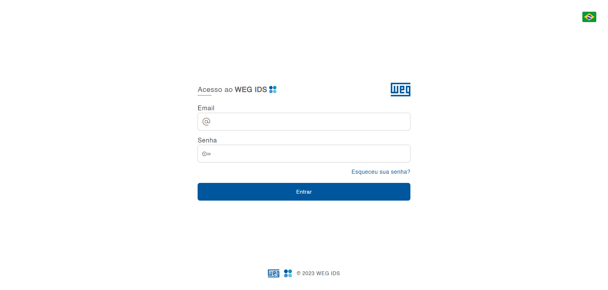

# Tutorial

Uma maneira mais fácil de gerenciar seus projetos.

## Login através de e-mail corporativo

Insira seu e-mail corporativo e sua senha. Clique no botão "Entrar".

## Método de recuperação de senha

Insira seu e-mail corporativo para onde irá ser encaminhado o passo a passo para a recuperação de senha.

## Página inicial

No canto superior direito fica a foto de perfil do usuário, bem como as bandeiras dos idiomas dispostos. Na lateral esquerda estão apresentadas todas as ações do sistema. Já no corpo da página é concedida todas as demandas feitas pelo usuários e pelo seu departamento, evitando assim sobrecarga com conteúdo duplicados e deixando os processos transparentes a aqueles que interessam.

## Barra lateral

**DEMANDAS** 

  No ícone    você conseguirá visualizar a página inicial, podendo pesquisar, filtrar e até mesmo ser direcionado a criar uma nova demanda. 

  FILTRO

  Nele você conseguirá filtrar as demandas de diversas formas. Quando filtra-las com as condições selecionadas, você terá a opção de exportar esses dados para um arquivo Excel. 

  

  MODO DE VISUALIZAR DEMANDAS

  São dispostos dois modos, para uma melhor organização e visualização das informações, são em eles em lista ou em cards.

  

**NOTIFICAÇÕES**

No ícone    você será notificado de todas as atualizações referente as demandas em que está relacionado. 

**CONFIGURAÇÕES**

No ícone    estará disposto todas as configurações referentes ao seu perfil, sejam elas a foto do usuário, senha, tamanho de fonte e configurações de notificações.  

**SAIR DO SISTEMA**

No ícone  você sairá do sistema.

Além disso, você poderá acessar essas funcionalidades através da imagem de perfil na barra superior do sistema.

**CHAT**

Quando o responsável por analisar a sua demanda achar necessário, ele poderá abrir um chat de conversa para que possam discutir sobre a sua solicitação. O ícone do chat    aparecerá na barra lateral juntamente com os outros ícones para que possa acessar facilmente essa funcionalidade. 

INSERIR PRINT

## Criar uma demanda

Como usuário, seu objetivo principal no sistema é criar uma demanda. Tendo isso em vista, você preencherá todos os dados necessários socilitados nas três etapas.

Você terá que preencher todos os campos obrigatóriamente para que a demanda seja efetivada. 

Na terceira etapa, você terá a opção de adicionar anexos caso necessário. 

